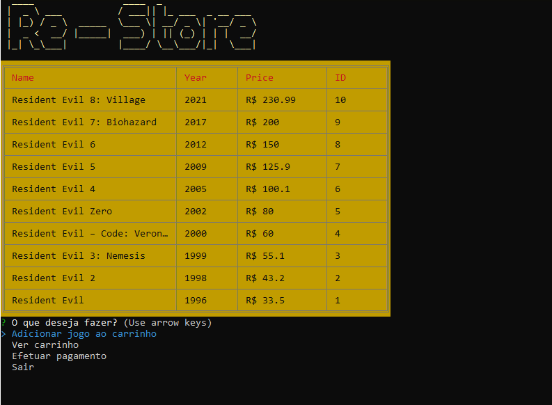

<h4 align="center"> 
	💸  Re - Store 💸
</h4>

## 💻 Sobre o projeto


Esse projeto foi feito com o intuito de colocar em prática algo que eu estava estudando: como criar interfaces de linha de comando.

O projeto consiste em simular uma loja de jogos sobre um tema específico, que no caso é o meu universo de jogos favorito: Resident Evil.

---

## ⚙️ Funcionalidades
- [x] O usuário pode adicionar um jodo no carrinho pelo ID:
- [x] O usuário pode ver os jogos que ele adicionou no carrinho
- [x] O usuário pode remover um jogo de dentro do seu carrinho pelo ID do jogo
- [x] O usuário pode efetuar a compra dos jogos selecionados em seu carrinho

---
<br>

## 💻 Demosntração
<a href="">
  
</a>

---

## 🚀 Como executar o projeto

### Pré-requisitos
Antes de tudo, é preciso cerfiticar-se que você tenha instalado na sua máquina as seguintes ferramentas: 
[Git](https://git-scm.com), [Node.js](https://nodejs.org/en/) e um editor de código. Sugiro: [VSCode](https://code.visualstudio.com/)

#### 🎲 Início

```bash

# Clone este repositório
$ git clone https://github.com/ndluz/Re-Store.git

# Instale as dependências
$ npm install

# Execute a o arquivo principal
$ node index.js


```

---

## 🛠 Tecnologias

As seguintes ferramentas foram usadas na construção do projeto:


-   **[Mocha](https://mochajs.org)** - Para realizar os testes
-   **[cli-table](https://github.com/Automattic/cli-table)** - Para criar tabelas
-   **[figlet](https://github.com/patorjk/figlet.js)** - Para criar o texto com letra garrafal
-   **[inquirer](https://github.com/SBoudrias/Inquirer.js)** - Para criar a interface de linha de comando
-   **[chalk](https://github.com/chalk/chalk)** - Para adicionar as cores
<br>

---